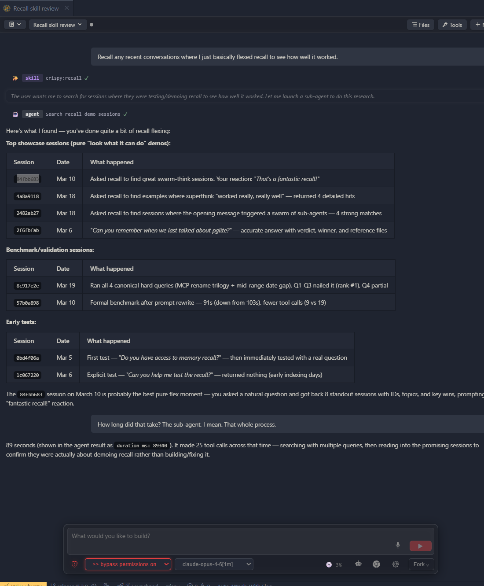

# Crispy

**A coding agent workbench for VS Code — with local agent memory, multi-agent collaboration, and controls you can't get in a terminal.**

Works with Claude Code and Codex. VS Code / Cursor extension.

[](https://open-vsx.org/extension/the-sylvester/crispy)
[](https://open-vsx.org/extension/the-sylvester/crispy)
[](LICENSE)
[](https://discord.gg/e2vw4bTPup)


**Agent memory** — searchable transcripts across all vendors, fully local.
**Multi-agent collaboration** — resumable cross-vendor sessions, directed by your agent of choice.
**Coding agent workbench** — fork, rewind, agency modes, tool auditing, side-by-side panels.

---

## What's New in v0.2.0

### Agent memory

Every session is indexed locally with full-text and semantic search. Your
agent can find past decisions, debugging threads, and design discussions
across Claude Code and Codex — and read the full conversation back. Not
summaries. Not rules files. The actual transcripts already saved on your
machine. No cloud, no API calls, no expiry.



### Multi-agent collaboration

Resumable Claude and Codex agents working together in back-and-forth
discussions directed by your coding agent of choice. Your agent dispatches
child sessions across vendors, gets parallel perspectives, and picks up
each session where it left off. No external MCP servers or configuration required.

### Icons render mode (new default)

The new default look. Minor tool calls are collapsed to inline icons that
flow with the conversation — click any icon to open the full detail in the
side panel. Keeps the focus on the conversation, not the tool calls.

### Voice input

Click-to-record voice input with local VAD and speech-to-text. Your speech
is transcribed locally and inserted into the chat input. Requires a
microphone.

### Inline quoting

Select text in any assistant response to quote it into your next message
with your own commentary. No more copy-pasting to reference something the
agent said.

### Copy-to-markdown

One-click copy buttons on assistant messages and tool output cards. Copies
clean, formatted Markdown to your clipboard.

### Project tracker (Experimental)

An AI-powered project tracker that watches your sessions and automatically
classifies what you're working on, what stage it's in, and what changed. View
tracked projects in a dedicated sidebar with stage-based grouping. Off by
default — enable in Settings.

---

## Capabilities

### Conversations


- Fork and rewind at any point — new session opens side-by-side with full context
- Side-by-side agent windows — as many as your editor can tile
- Execute Markdown files as prompts from the Explorer context menu
- Session browser with search and vendor filtering

### Agent intelligence

- Agent memory — full-text and semantic search across all sessions and vendors
- Multi-agent collaboration — resumable cross-vendor child sessions
- Claude Code and Codex adapters

### Execution control


- Agency modes — plan, ask-before-edits, auto-accept, bypass (persisted per session)
- Dedicated tool panel for auditing tool calls and sub-agent work
- One-click bypass mode and pop-out to external browser

### UI

- Four rendering modes — Icons (default), Blocks, Compact, YAML
- Inline quoting and copy-to-markdown
- Voice input with local VAD and speech-to-text
- Image attachments, @mentions, linkified file paths and URLs
- Light, dark, and high-contrast themes

### Providers


- Custom model providers — route through any Claude-compatible endpoint
  (GLM-4.7, DeepSeek, local models)
- One-click model switching across vendors

### Experimental

- Project tracker — AI-powered session classification (off by default)
- Browser mode — full UI at `localhost:3456`, no VS Code required

---

## Coming Soon

- OpenCode adapter
- Gemini CLI adapter
- Standalone browser app — packaged desktop build, no VS Code dependency

---

## Installation

### Option 1: OpenVSX Marketplace

Search for **"Crispy"** in the VS Code extensions panel and install it
directly.

### Option 2: CLI

```bash
code --install-extension the-sylvester.crispy
```

Or download the `.vsix` file from the
[OpenVSX Marketplace](https://open-vsx.org/extension/the-sylvester/crispy) and
install manually via **Extensions > Install from VSIX**.

### Option 3: From Source

```bash
git clone https://github.com/TheSylvester/crispy.git
cd crispy
npm install
npm run build
```

Then press `F5` in VS Code to launch the extension development host.

To build a target-specific VSIX that only includes the matching native voice
runtime, use one of:

```bash
npm run package:linux-x64
npm run package:linux-arm64
npm run package:darwin-x64
npm run package:darwin-arm64
npm run package:win32-x64
npm run package:win32-arm64
```

---

## Usage

1. Open VS Code in any project
2. Run `Crispy: Open` from the command palette (`Ctrl+Shift+Alt+I`)
3. Browse sessions in the sidebar, or start a new conversation
4. Use the control panel at the bottom for chat input, model selection, and
   agency mode toggles

---

## Requirements

- VS Code 1.94+ (or any compatible fork)
- Claude Code CLI installed and authenticated
- Codex CLI (optional, for Codex sessions)
- Microphone (optional, for voice input)

---

## Community

- [Discord](https://discord.gg/e2vw4bTPup) — support, feature requests, and discussion
- [GitHub Issues](https://github.com/TheSylvester/crispy/issues) — bug reports and tracking

---

## Third-Party Notices

**`@anthropic-ai/claude-agent-sdk`** — The Claude adapter depends on
Anthropic's Agent SDK, which is proprietary ("All rights reserved") and
governed by [Anthropic's Terms of Service](https://code.claude.com/docs/en/legal-and-compliance).
This dependency is required for Claude Code integration. By using Crispy with
Claude Code, you accept Anthropic's terms for that SDK.

**Codex protocol types** — Files in `src/core/adapters/codex/protocol/` are
generated from the [OpenAI Codex CLI](https://github.com/openai/codex)
project, licensed under Apache-2.0. See `THIRD-PARTY-LICENSES` for details.

## License

MIT — see [LICENSE](LICENSE) for the full text.
