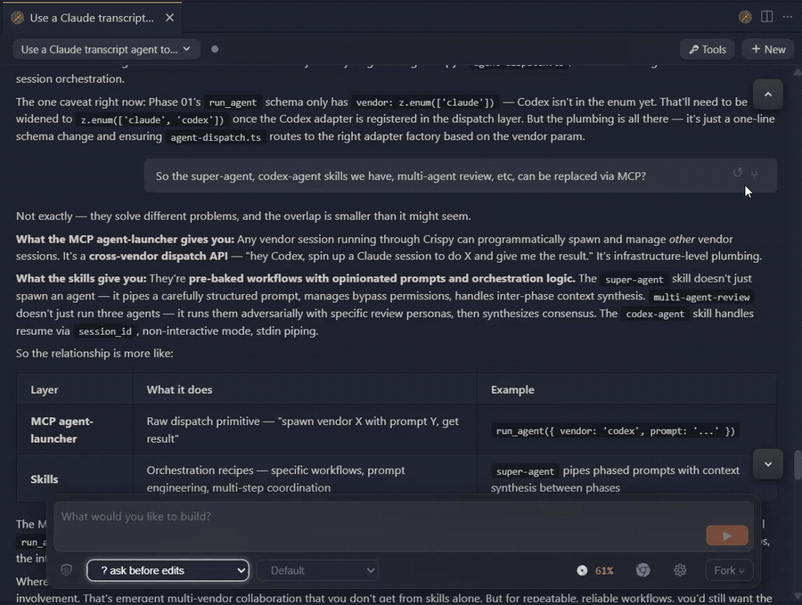
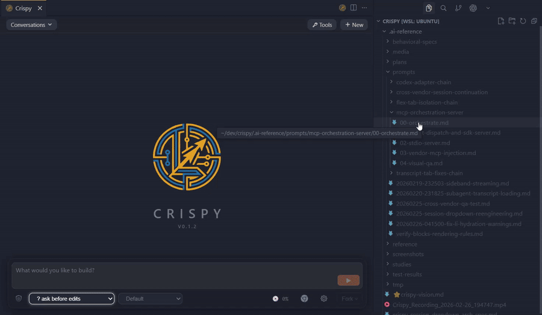
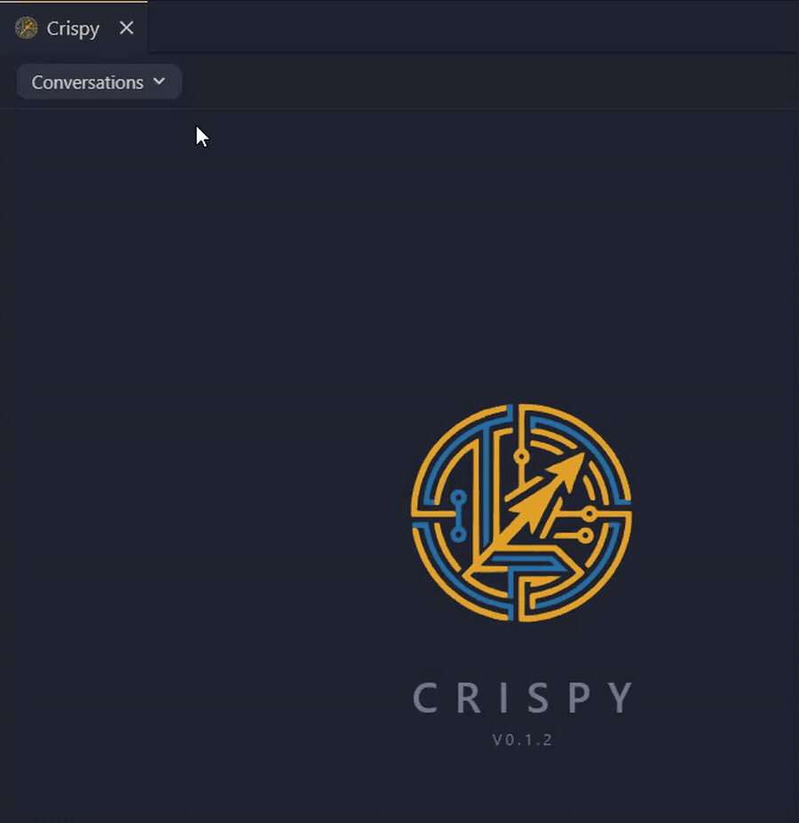
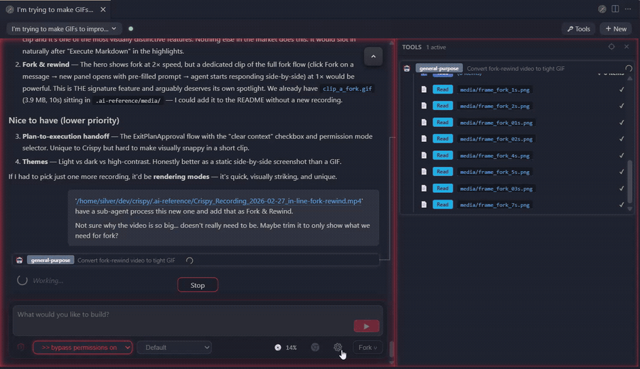
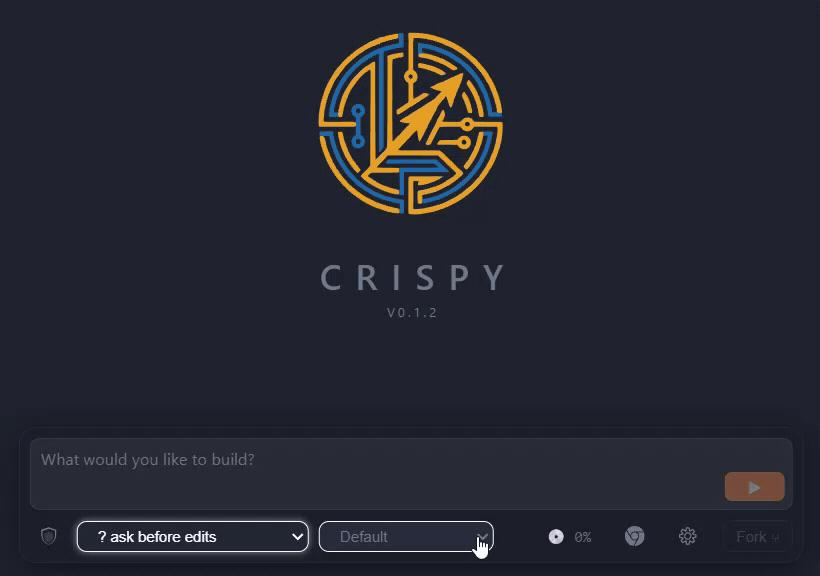

# Crispy

**A zero-compromise UI for Claude Code, Codex, and more — with controls you can't get in a terminal.**

Rendered Markdown. Fork and rewind conversations. Multiple agent windows side by side. Audit tool calls and sub-agent work in a dedicated panel. One-click bypass, Chrome, models, and permissions. Execute Markdown files directly as prompts.

VS Code / Cursor extension today. Standalone browser app after v0.1.x.


---

## Why Crispy?

The official Claude Code VS Code extension is good. But it ships a subset of
what the TUI can do, and it locks you into one vendor. Crispy fills the gaps.

---

## Feature Highlights

### Fork and rewind conversations



Fork at any point in a conversation. The new session opens in a second panel
with full context — branch into parallel explorations or try a different
approach.

### Execute Markdown files as agent prompts



Right-click any `.md` file in the Explorer and select **Execute in Crispy**.
Your prompt loads into a new session, ready to send — the agent starts
immediately.

### Session browser with search and filtering



Browse every session across vendors in one place. Filter by Claude or Codex,
search by title, and jump between conversations grouped by day.

### Three rendering modes



**Blocks** for daily use with rich tool cards, **Compact** for skimming dense
transcripts, **YAML** for raw observability. Switch instantly on the same
conversation.

### Four agency modes


One click to cycle between **plan**, **ask before edits**, **auto-accept**, and
**bypass**. Each mode has a distinct border color and icon so you always know
the agent's leash.

### Models and custom providers



Switch between Claude and Codex, or add custom Claude-compatible providers
with their own base URLs, API keys, and model mappings.

---

## Features

- Fork and rewind conversations
- Side-by-side agent windows — as many as your editor can tile
- Dedicated tool panel for auditing tool calls and sub-agent work
- One-click bypass mode and Chrome toggle
- Execute Markdown files as prompts from the Explorer
- Claude and Codex adapters today — Gemini CLI and OpenCode next
- Custom model providers — route Claude through any Claude-compatible endpoint
  (GLM-4.7, DeepSeek, local models)
- Plan-to-execution handoff — clear context and start fresh
- Three rendering modes — Blocks for daily use, Compact for skimming,
  YAML for observability
- Agency modes — plan, auto-accept, ask-before-edits, bypass
- Session browser with search and vendor filtering
- Image attachments, @mentions, linkified URLs
- Light, dark, and high-contrast themes
- **Experimental (insecure):** Browser mode at `localhost:3456`

---

## Coming Soon

- Cross-vendor memory system
- Agent delegation across vendors

---

## Installation

### Option 1: OpenVSX Marketplace

Search for **"Crispy"** in the VS Code extensions panel and install it
directly.

### Option 2: CLI

```bash
code --install-extension the-sylvester.crispy
```

Or download the `.vsix` file from the
[OpenVSX Marketplace](https://open-vsx.org/extension/the-sylvester/crispy) and
install manually via **Extensions > Install from VSIX**.

### Option 3: From Source

```bash
git clone https://github.com/TheSylvester/crispy.git
cd crispy
npm install
npm run build
```

Then press `F5` in VS Code to launch the extension development host.

---

## Usage

1. Open VS Code in a project that has Claude Code or Codex sessions
2. Run `Crispy: Open` from the command palette (`Ctrl+Shift+Alt+I`)
3. Browse sessions in the sidebar, or start a new conversation
4. Use the control panel at the bottom for chat input, model selection, and
   agency mode toggles

---

## Requirements

- VS Code 1.94+ (or any compatible fork)
- Claude Code CLI installed and authenticated
- Codex CLI (optional, for Codex sessions)

---

## Third-Party Notices

**`@anthropic-ai/claude-agent-sdk`** — The Claude adapter depends on
Anthropic's Agent SDK, which is proprietary ("All rights reserved") and
governed by [Anthropic's Terms of Service](https://code.claude.com/docs/en/legal-and-compliance).
This dependency is required for Claude Code integration. By using Crispy with
Claude Code, you accept Anthropic's terms for that SDK.

**Codex protocol types** — Files in `src/core/adapters/codex/protocol/` are
generated from the [OpenAI Codex CLI](https://github.com/openai/codex)
project, licensed under Apache-2.0. See `THIRD-PARTY-LICENSES` for details.

## License

MIT — see [LICENSE](LICENSE) for the full text.
